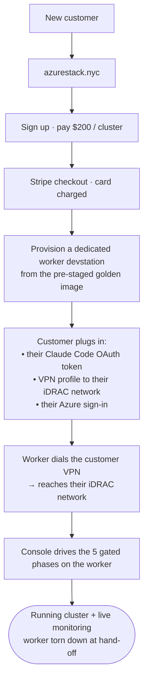
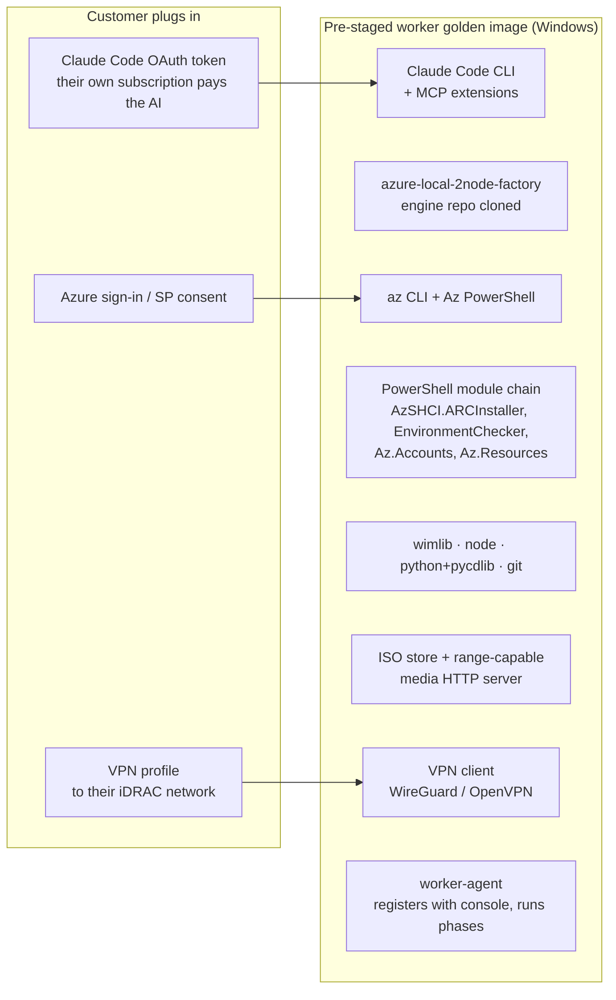
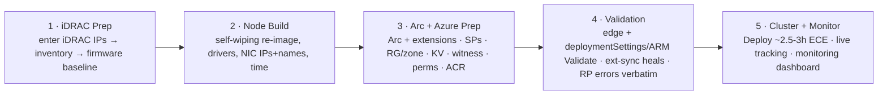

# azure-local-deploy-console

**The product side of AzureStack.NYC — the website, the deployment console, and the worker
devstation that actually builds a customer's Azure Local cluster.**

This repo is one half of a two-repo system:

| Repo | Role |
| --- | --- |
| [**azure-local-2node-factory**](https://github.com/gusitllc/azure-local-2node-factory) | the AI-assisted cluster-build **engine** — bash stages 00–60, iDRAC Redfish control, self-wiping WinPE re-image, Arc onboarding, Validate→Deploy. Runs *on the worker*. |
| **azure-local-deploy-console** (this repo) | the **product**: the azurestack.nyc site, the AKS console (UI + API + run state + intervention gates), and the worker-devstation golden image that runs the engine against a customer's hardware. |

## The service, end to end

**Why two pieces (console on AKS + worker on a devstation):** the engine's ISO builder P/Invokes
Windows `shlwapi.dll`/IMAPI2 and drives iDRAC virtual media over an L2-reachable network — it
**cannot run in a Linux pod**. So the console (stateless Linux container on AKS) owns the UI, API,
run state machine, and intervention gates, and **dispatches each phase to a Windows worker
devstation** that has the tooling, the ISO store, and — via VPN — reach to the customer's iDRACs.
Each customer/run gets its **own** worker, which also gives the per-run isolation the engine needs
(separate `az` context, separate virtual-media HTTP port, separate working tree).

## The worker devstation — a pre-staged golden image

On payment we spin up a copy of a **golden image** that already contains everything needed to build
a cluster, so it's ready in minutes, not hours. The customer supplies only three things.

**What's pre-staged (baked into the image — `worker/prestage/`):**
- **Claude Code CLI + MCP extensions** — the AI that assists the build. Customer plugs their **own
  Claude Code OAuth token** at first run (their subscription pays for the AI; we never hold it).
- **The engine** — `azure-local-2node-factory` cloned, plus all `lib/`, `build/`, `recover/`,
  `stages/` and the pre-seeded PowerShell modules (`AzSHCI.ARCInstaller`, `AzStackHci.EnvironmentChecker`,
  `Az.Accounts`, `Az.Resources`) so Arc onboarding has zero cold-install time.
- **The toolchain** — `az` CLI + Az PowerShell, `wimlib`, `node`, `python`+`pycdlib`, `git`,
  PowerShell remoting configured (`TrustedHosts`).
- **The ISO store** — verified Azure Local OS images + a range-capable HTTP server the iDRACs pull
  virtual media from.
- **A VPN client** (WireGuard/OpenVPN) — the customer is **not on our network**; the worker imports
  the customer's VPN profile and dials into **their** iDRAC network to reach the servers.
- **The worker-agent** — registers with the console, brings up the VPN, claims phase jobs, executes
  engine stages in an isolated working tree, and streams structured logs back (secrets redacted).

**What the customer supplies (never stored on our site, held only in the worker's key store):**
1. Their **Claude Code OAuth token**.
2. A **VPN profile** to their iDRAC network (plus the iDRAC IPs/credentials, entered in Phase 1).
3. Their **Azure** sign-in / service-principal consent (for the deployment subscription).

## The console — five gated phases, many clusters at once

Runs are independent pipelines; N clusters can be at different phases simultaneously. Any phase (or
named stage boundary) can be marked **pause-for-approval** — destructive actions (firmware apply,
disk wipe) gate ON by default.

## Repo layout

| Path | What |
| --- | --- |
| `site/` | the azurestack.nyc marketing site + `$200` service sign-up + Stripe checkout (Cloudflare Pages) |
| `console/` | the AKS container app — Node/Express + SQLite run state, SSE logs, admin page (vanilla JS), engine-dispatch adapter |
| `worker/prestage/` | golden-image staging: `PRESTAGE.md` manifest + `stage-worker.ps1` (tools, modules, Claude Code, VPN client, engine clone, ISO store) |
| `worker/agent/` | the worker-agent — console registration, VPN bring-up, job claim, stage execution, log streaming |
| `docs/` | the 7-artifact formation suite (CORE-IDEA, PURPOSE, DESIGN, COST-MODEL, IMPLEMENTATION-PLAN, DEPLOYMENT, IMPLEMENTATION-TRACKER) + PhD review |

## Non-negotiables

- **Secrets never leave the customer's key store.** Claude Code token, iDRAC/Azure creds, deployment
  secrets live only in the worker's protected store / the customer's Key Vault — never in this repo,
  the console DB, logs, or SSE streams (redacted at the boundary).
- **The engine is the single source of truth.** The console orchestrates the factory stages as child
  processes; it never re-implements deployment logic.
- **Destructive actions gate by default.** Firmware apply and disk wipe require an explicit approval.
- **Cloud errors are shown verbatim.** RP/validation failures are surfaced exactly as returned.
- **Per-run isolation.** Each run/worker has its own engine working tree, `az` context, and
  virtual-media port — no shared global state across parallel deployments.

## Status

Formation suite complete (`docs/`). Site + `$200` sign-up live at
[azurestack.nyc](https://azurestack.nyc). Console + worker scaffolds in progress; first end-to-end
proof deploys a real 2-node cluster through the console, watched live.
