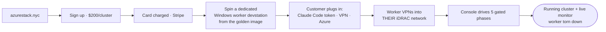

# CORE-IDEA — Azure Local Deployment Console

> Blueprint 1 of 14. The one-page essence.

## One sentence

**A customer pays $200 on azurestack.nyc, and an AI-driven service builds their Azure Local cluster
end to end — over a VPN into their own iDRAC network — through five supervised phases they watch and
approve live, with zero software installed on their side.**

## The problem

Standing up an Azure Local (Azure Stack HCI) cluster is a multi-day, expert-only job: firmware
baselining, bare-metal OS imaging, driver/NIC/time config, Arc onboarding, a dozen Azure
prerequisites, cloud validation, and a ~3-hour deployment — each step a well-known trap. Most
businesses that *want* Azure Local don't have the specialist, the runbook, or the patience. The
expertise, not the hardware, is the bottleneck.

## The solution

A **productized deployment service**, in two halves:

- **The engine** ([azure-local-2node-factory](https://github.com/gusitllc/azure-local-2node-factory)) —
  the proven, public, AI-assisted build automation: iDRAC Redfish control, self-wiping WinPE
  re-image, Arc onboarding, Validate → Deploy. It ran a real cluster this week.
- **The product** (this repo, azure-local-deploy-console) — the website, the **console** (a control
  tower on AKS with a five-phase state machine and intervention gates), and a **per-customer worker
  devstation** (a pre-staged Windows golden image) that runs the engine against the customer's
  hardware over a VPN.

The customer never installs anything or learns the runbook. They pay, plug in three things (a Claude
Code OAuth token, a VPN profile to their iDRAC network, and an Azure sign-in), and watch the console
drive the build — approving at each gate they choose.

## The flow

## What makes it different

1. **Deployed, not shipped.** No appliance to install, no runbook to learn — a paid service that
   drives the customer's own metal remotely.
2. **AI-assisted build.** Claude Code (on the worker, paid by the customer's own token) assists the
   engine through the traps that normally require a human expert.
3. **Watch-and-approve, not black-box.** Five phases, each pausable at operator-chosen gates;
   destructive actions (firmware, wipe) gate by default; every cloud error shown verbatim.
4. **Parallel by design.** One worker per cluster means many customers/clusters deploy at once with
   no shared global state.
5. **Reach into any network.** A VPN client on the worker means the customer's servers can be on any
   private iDRAC network, anywhere.

## Non-negotiables

1. **Secrets never leave the customer's boundary.** Claude Code token, iDRAC/Azure credentials, and
   deployment secrets live only in the worker's protected store or the customer's Key Vault — never
   in this repo, the console database, logs, or event streams.
2. **The engine is the single source of truth.** The console orchestrates the factory stages; it
   never re-implements deployment logic. Fixes land in the engine repo.
3. **Every phase is resumable and haltable.** A pod restart, a worker reboot, or an operator halt
   never forces a from-scratch rebuild; a run can be stopped and held at any phase.
4. **Destructive actions gate by default.** Firmware apply and disk wipe require explicit approval.
5. **Cloud errors verbatim.** RP/validation failures reach the operator unparaphrased (the
   "Unsupported OS Version" lesson).
6. **The worker is ephemeral and Windows.** The engine's ISO builder is Windows-only; each worker is
   a throwaway devstation torn down at hand-off.
7. **Standalone-deployable, platform-clean.** Its own Postgres, its own auth; parameterized SQL,
   `esc()` on rendered content, response shape `{ok:true,…}|{ok:false,error}`, vanilla JS UI,
   config-driven (zero hardcoded IPs/paths/thresholds).

## Success looks like

A non-expert operator deploys **N clusters in parallel** from a browser, with a handful of approvals
each, no secret ever exposed, and every failure surfaced with the exact upstream cause — and the
first proof is this console rebuilding a real 2-node cluster end to end, watched live.
