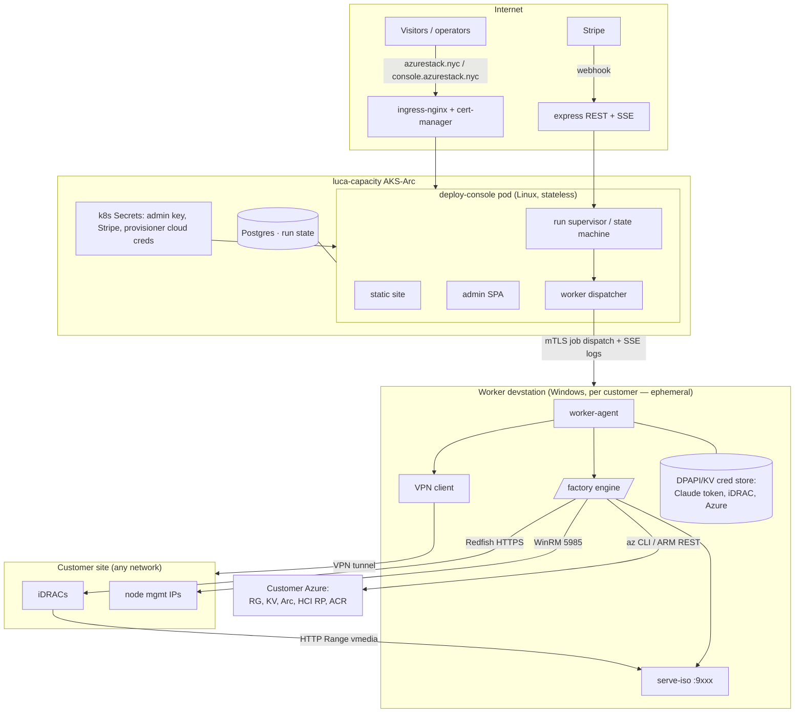
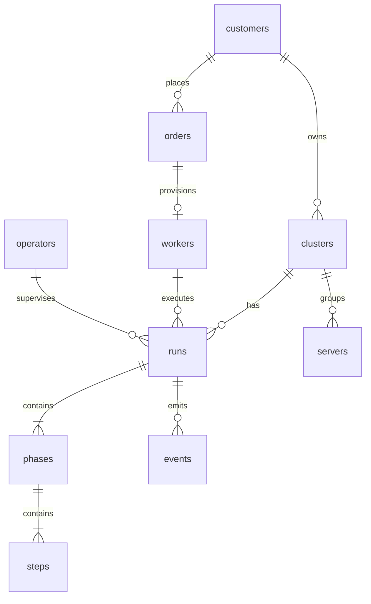
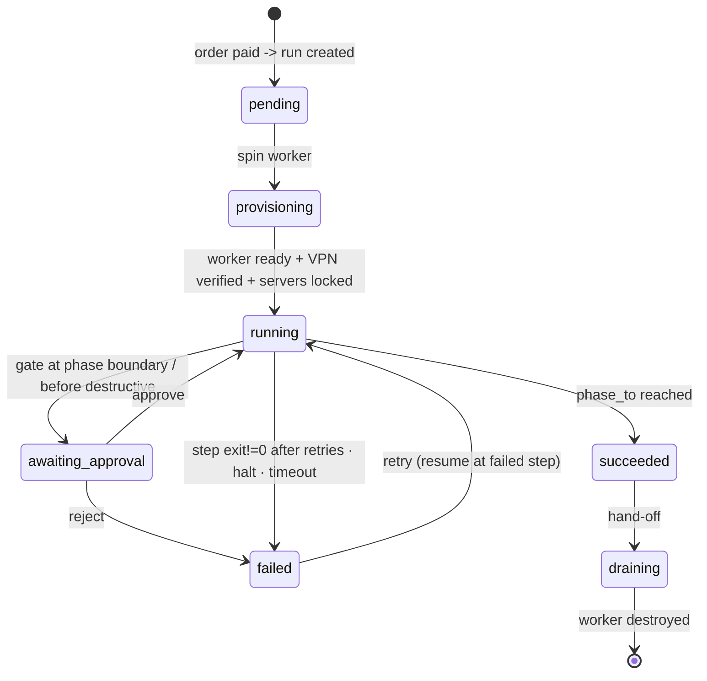

# DESIGN — Azure Local Deployment Console

> Blueprint 3 of 14. Architecture, topology, data model (Postgres), state machine, engine dispatch,
> phase→stage matrix, open questions.

## 1. Topology — console on AKS, engine on a Windows worker

The console is a **stateless Linux container** on `luca-capacity` (AKS-Arc). It does **not** run the
engine: the engine's ISO builder P/Invokes Windows `shlwapi.dll`/IMAPI2 and must drive iDRAC virtual
media over an L2-reachable network — impossible in a Linux pod. So the console **dispatches each
phase to a per-customer Windows worker devstation** over a mutually-authenticated channel. This also
gives the per-run isolation parallel deployments require (separate `az` context, ISO port, working
tree) for free — one worker per run.



**Console responsibilities:** website + admin UI + API; the run/phase/step state machine; gates,
halt, retry; provisioning a worker on payment; dispatching phase jobs; ingesting worker log/state
streams; verbatim error capture; Postgres persistence. **It never touches a secret's value** beyond
handing the provisioner cloud creds to spin a worker; customer iDRAC/Azure/Claude secrets flow
browser → worker cred store directly, never through console storage.

**Worker responsibilities:** bring up the VPN; verify iDRAC reachability; run the dispatched engine
stages in an isolated working tree with per-run `az` context and ISO port; stream structured
logs/state back (secrets redacted at the boundary); hold customer secrets in DPAPI/Key Vault only.

## 2. Module contract (console, each file < 300 lines)

```js
module.exports = {
  id: 'azlocal-deploy-console', version: '1.0.0',
  requires: ['postgres', 'k8s-secrets(env)'],
  services: {
    db:      'lib/db.js',          // pg Pool, parameterized only, migrations runner
    auth:    'lib/auth.js',        // admin key + operators, requireAuth/requireCapability
    runner:  'lib/runner.js',      // state machine: scheduler, gates, phase sequencing
    dispatch:'lib/dispatch.js',    // worker channel: job send, log/state ingest (mTLS)
    provision:'lib/provision.js',  // spin/destroy a worker devstation on payment/hand-off
    events:  'lib/events.js',      // append-only event log + SSE fanout (LISTEN/NOTIFY)
    billing: 'lib/billing.js',     // Stripe checkout + webhook -> run creation
    heal:    'lib/heal.js',        // heal hooks (ext-sync, erase-unstick, az-relogin)
  },
  routes: 'routes/*.js', ui: ['public/', 'public/admin/'],
  health: '/api/health',
};
```

Responses `{ok:true,…}|{ok:false,error}`; all UI via fetch + vanilla JS; all rendered content through
`esc()`.

## 3. Data model (Postgres, schema `console`)



| Table | Key columns |
| --- | --- |
| `customers` | id, email, company, stripe_customer_id, created_at |
| `orders` | id, customer_id, stripe_session_id, amount_cents, clusters_qty, status(`paid`/`refunded`), created_at |
| `workers` | id, order_id, provider_ref (VM/devstation id), status(`provisioning`/`ready`/`draining`/`gone`), enroll_token_hash, mtls_fp, vpn_verified BOOL, last_seen_at |
| `clusters` | id, customer_id, name, config_json (nodes, NIC Port1..4 plan, IP plan, NTP, OU, witness, az_subscription, resource_group, location, cluster_name) |
| `servers` | id, cluster_id, idrac_ip, idrac_user, cred_ref (worker key-store handle — never a password), model, service_tag, health, bios_ver, fw_json, last_inventory_at, locked_by_run_id |
| `runs` | id, cluster_id, worker_id, status, gates_json, phase_from, phase_to, current_phase, error_verbatim, halt_requested, created_by, started_at, finished_at |
| `phases` | id, run_id, idx(1..5), name, status, started_at, finished_at |
| `steps` | id, phase_id, idx, name, stage_cmd, status, exit_code, attempt, max_attempts, timeout_s, log_ref, error_excerpt |
| `events` | id, run_id, ts, level, phase_idx, step_id, type, message (append-only; SSE reads here; resume via Last-Event-ID) |
| `operators` | id, username, pass_hash (scrypt), role, capabilities_json, disabled |
| `sessions` | token, operator_id, expires_at |
| `settings` | key, value (factory_commit, iso_port_range, max_parallel_runs, default_gates, retry_policy) |

Postgres specifics: **`LISTEN/NOTIFY`** drives SSE fanout across pods; a partial unique index enforces
**one active run per server** (`WHERE locked_by_run_id IS NOT NULL`); JSONB for `*_json`; all writes
in transactions; migrations are ordered SQL files applied by `lib/db.js` (see DB-DATA-EXCELLENCE).

## 4. State machine

A **run** = one cluster through up to 5 **phases**; each phase = ordered **steps** (one engine
command each). States for run/phase/step: `pending | running | awaiting-approval | failed |
succeeded | skipped`.



**Gates** (`gates_json`, chosen at run creation): pause after any phase and/or before any destructive
action (stage-17 wipe, Phase-5 Deploy) — destructive gates default ON. A gate sets the run
`awaiting-approval` until `POST /api/runs/:id/approve` (or `reject`). **Halt** (`POST
/api/runs/:id/halt`) SIGTERM→SIGKILLs the worker's current step process group and holds the run —
essential because cloud validation can dead-end (the RP "Unsupported OS Version" gate). **Retry**
resumes at the failed step; all engine stages are idempotent/re-runnable.

## 5. Engine dispatch (console ⇄ worker)

```mermaid
sequenceDiagram
  participant R as runner (console)
  participant D as dispatch (console)
  participant A as worker-agent
  participant P as engine stage (Windows proc group)
  R->>D: dispatch(run, phase, step, cluster.config, secretRefs)
  D->>A: JOB {runId, stageCmd, env(non-secret), secretRefs} (mTLS)
  A->>A: resolve secretRefs from local cred store (never leave worker)
  A->>P: spawn stage in C:\worker\runs\<runId>\engine (per-run az ctx, ISO port)
  P-->>A: stdout/stderr line-buffered
  A->>A: redact(line) — replace every known secret value with ***
  A-->>D: EVENTS (log lines, step state, exit code) over SSE upstream
  D->>R: persist events + state; NOTIFY -> browser SSE
  P-->>A: exit(code)
  A-->>D: exit -> code==0 succeeded; else retry(backoff) or failed(excerpt+RP verbatim)
```

- **Secrets by reference, resolved on the worker.** The console sends secret *refs*, never values;
  the worker-agent resolves them from its DPAPI/Key Vault store. Values never traverse the console.
- **Verbatim RP errors** stored to `runs.error_verbatim` (secret-scrubbed only).
- **Per-run isolation** on the worker: own engine working-tree copy (stages write back into the
  engine root), own `AZURE_CONFIG_DIR`, own `serve-iso` port from `iso_port_range`.
- **ISO integrity** verified (`wimlib-imagex info` on the extracted `install.wim`, via pycdlib) before
  a node boots — filenames prove nothing.

## 6. Phase → stage matrix (engine commands the worker runs)

| Phase | Steps | Engine (in the worker's `engine/`) | Gate |
| --- | --- | --- | --- |
| **1 iDRAC Prep** | reach+inventory · fw compare · fw apply · preflight | `lib/redfish.sh` fan-out (`rf_reachable/rf_sysinfo/rf_health/rf_serial/rf_bios`) · `lib/fw-compare.js`+`fw-plan.js` (per-model catalog) · `stages/15-firmware-baseline.sh` (Redfish SimpleUpdate) · `stages/10-preflight.sh`+`lib/hw-validate.sh` | **fw apply gates** |
| **2 Node Build** | images · wipe · build ISOs · boot · OS wait · NICs+time · drivers | `05-download-images` · `17-wipe-disks` · `18-build-isos`(+wim verify) · `20-idrac-bootstrap`+`25-eject-after-copy` · `30-os-wait`(build-gated) · `32-nic-names` · `35-drivers` | **wipe gates (destructive)** |
| **3 Arc + Azure** | Azure prep · KV+secrets · permissions · Arc onboard · ACR | `00-azure-prep`(SP, RG, witness, RP) · KV + 3 secrets · `lib/assign-deploy-permissions.sh` · `40-arc-register`+ wait 4 AzureEdge exts · ACR | gate after phase |
| **4 Validation** | settings · Validate | `lib/build-deployment-settings.js`+`build/gen-arm-parameters.py` · `50-cluster-deploy.sh --validate` + `lib/track-deployment.sh`; heal `lib/ext-version-sync.sh` on version drift | gate after phase |
| **5 Cluster + Monitor** | Deploy · live track · post-deploy | `50-cluster-deploy.sh` (Deploy, ~55 ECE steps) · `lib/track-deployment.sh` → progress · monitoring dashboard; recover `recover/recover.sh`, redo `rebuild-cluster.sh` | **Deploy gates (destructive)** |

## 7. Provisioning & billing seam

`POST /api/deploy-signup` (site) → Stripe Checkout → **webhook** (`checkout.session.completed`) →
`billing.js` creates `customers`/`orders`, then `provision.js` spins a worker from the golden image
(cloud API), mints an enrollment token, and creates a `run` in `pending`. The worker-agent enrolls
(mTLS), the customer supplies Claude token + VPN profile + Azure sign-in, the VPN verifies, and the
scheduler moves the run to `running`.

## 8. Open questions

- **OQ-1 worker platform** — Azure VM (Windows) vs. an on-prem Hyper-V devstation per customer;
  affects provision.js and cost. (Default: cloud Windows VM, torn down at hand-off.)
- **OQ-2 VPN model** — customer supplies a WireGuard/OpenVPN profile vs. we host a rendezvous relay
  they dial into. (Default: customer profile, simplest + most private.)
- **OQ-3 N-node** — engine is 2-node-switchless-shaped; v1 constrains to 2-node.
- **OQ-4 dual-operator approval** for destructive gates — policy toggle in `settings`.
- **OQ-5 credential store** — worker DPAPI (v1) vs. customer Azure Key Vault refs (v2, better audit).