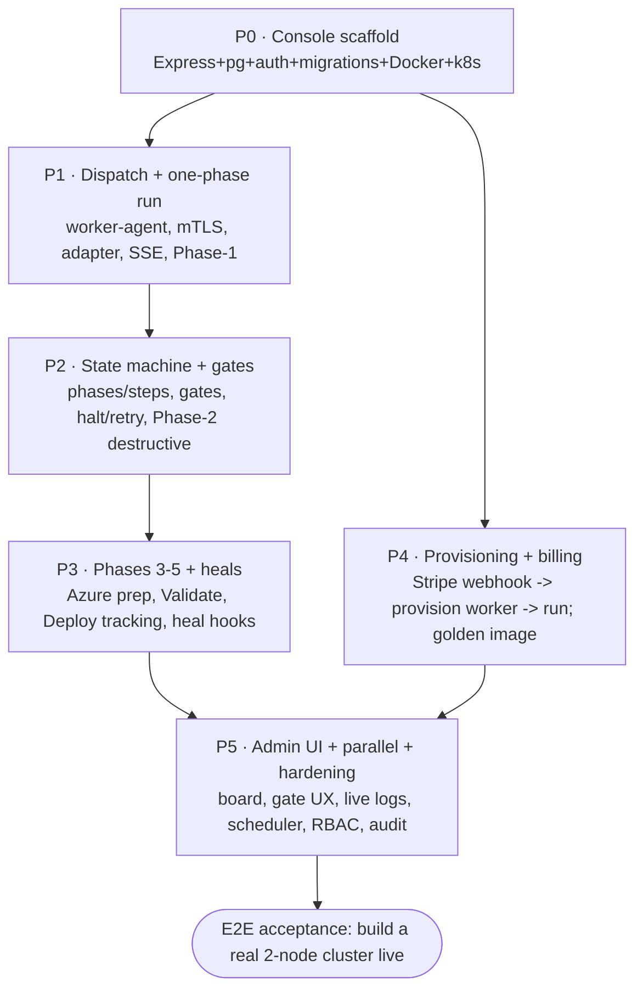

# IMPLEMENTATION-PLAN — Azure Local Deployment Console

> Blueprint 5 of 14. Phased build, roster, dependency graph, stage-gate mechanics, per-phase
> acceptance + end-to-end test, research foundations, sign-off.

## Roster (AI-agent roles)

| Role | Owns |
| --- | --- |
| **architect** | this blueprint, schema, API/worker contract, gate policy |
| **builder** | console services, routes, worker-agent, admin UI |
| **integrator** | engine adapter, dispatch channel, provisioning, Stripe |
| **reviewer** | code review vs. platform standards + the excellence layers |
| **tester** | stage idempotency, gate/halt/retry tests, the E2E acceptance run |
| **deployer** | Dockerfile, k8s manifests, golden-image build, DNS/TLS |

## Dependency graph

## Stage-gate mechanics

Each phase ships behind a **feature flag** and is not "done" until its **acceptance criteria** pass
**and** the reviewer signs off against the relevant excellence layer. No phase merges to `main`
unflagged. The whole app is closed out only after the **E2E acceptance run** and the CD/CI-CD release
(change-management → az acr build → deploy → verify).

## Per-phase detail

### P0 — Console scaffold `flag: CONSOLE_CORE`
- **Steps:** `lib/db.js` (pg Pool + ordered SQL migrations); `lib/auth.js` (admin key bootstrap +
  operators, scrypt, session cookie, requireAuth/requireCapability); `server.js` (express, static
  site, `/api/health` real metrics); Dockerfile (node 22 slim); k8s Deployment/Service/Ingress +
  Secret; serve the existing azurestack.nyc pages.
- **Acceptance:** pod boots on `luca-capacity`; `/api/health` returns real metrics (db rw, migration
  version, disk free); admin key creates an operator; site pages render.
- **Excellence gate:** SECURITY-PRIVACY (auth on all routes), DB-DATA (migrations/parameterized).

### P1 — Dispatch + one-phase run `flag: CONSOLE_DISPATCH`
- **Steps:** `worker-agent` (enroll via token → mTLS, register, heartbeat); `lib/dispatch.js`
  (send job, ingest SSE log/state); engine adapter on the worker (spawn stage, redact, capture,
  exit→state); Phase-1 read-only (`servers` + `POST /api/servers/inventory` fan-out over
  `lib/redfish.sh`); `lib/events.js` + SSE to browser (pg LISTEN/NOTIFY).
- **Acceptance:** register N iDRAC IPs; run Phase-1 inventory against a real iDRAC; model/serial/
  health populate; log lines stream live to the admin page; no secret appears in any log.
- **Excellence gate:** RELIABILITY-OBSERVABILITY (SSE resume, redaction), PERFORMANCE-SCALE (per-run env).

### P2 — State machine + gates `flag: CONSOLE_RUNS`
- **Steps:** `lib/runner.js` (phase/step sequencing, scheduler, `max_parallel_runs`, server locks);
  gates (`gates_json`, awaiting-approval, approve/reject); halt (kill process group) + retry (resume
  at failed step); Phase-2 behind `before_destructive` gate (wipe → build ISOs → boot → OS-wait →
  NICs → drivers) with **build-gated** OS verification and ISO wim-verify.
- **Acceptance:** create a run; it pauses at a gate; approve advances it; halt kills the running
  stage and holds; retry resumes at the failed step; a server can't be in two active runs.
- **Excellence gate:** TEST-QUALITY (gate/halt/retry tests), RELIABILITY (resumability).

### P3 — Phases 3–5 + heals `flag: CONSOLE_DEPLOY`
- **Steps:** Phase-3 Azure prep (SP/RG/witness/RP, KV + 3 secrets, `assign-deploy-permissions`, Arc
  onboard + 4 extensions, ACR); Phase-4 Validate (`build-deployment-settings` + `gen-arm-parameters`
  → `50 --validate` + `track-deployment`); Phase-5 Deploy + live `track-deployment` progress;
  `lib/heal.js` (ext-sync, erase-unstick, az-relogin); **verbatim RP error** capture.
- **Acceptance:** on a real pair, Phases 3–4 reach Validate and surface the actual RP result
  verbatim; ext-version drift triggers the ext-sync heal; Deploy tracking renders live progress.
- **Excellence gate:** SECURITY (secret→KV never logged), RELIABILITY (heals, verbatim errors).

### P4 — Provisioning + billing `flag: CONSOLE_BILLING`
- **Steps:** `lib/billing.js` (Stripe Checkout on the site + `checkout.session.completed` webhook →
  customer/order/run); `lib/provision.js` (spin a worker from the golden image, enrollment token,
  destroy on hand-off); `worker/prestage/stage-worker.ps1` build + snapshot + a booted-image test.
- **Acceptance:** a $200 test-mode checkout provisions a worker that enrolls and reports `ready`;
  refund path marks the order; a canceled checkout provisions nothing.
- **Excellence gate:** SECURITY (Stripe signature verify, no card data), COST-MODEL adherence.

### P5 — Admin UI + parallel + hardening `flag: CONSOLE_ADMIN`
- **Steps:** admin board (parallel run cards, phase timeline, gate approve/deny, live log pane,
  iDRAC-console screenshots, halt/retry/skip); scheduler for parallel runs; RBAC roles; audit log
  (every approve/skip/halt records actor+reason); settings/operators CRUD.
- **Acceptance:** three runs visible at different phases simultaneously; an operator approves a gate,
  halts a run, retries another — all from the board; audit entries recorded.
- **Excellence gate:** UI-UX (board clarity, gate affordances), SECURITY (RBAC, audit), PERFORMANCE.

## End-to-end test use case (acceptance)

> **A non-expert operator deploys a real 2-node cluster from the console.**
> Register the two iDRAC IPs → run Phase-1 (inventory + firmware baseline, approve the plan) → Phase-2
> (approve the wipe gate; nodes re-image to a release-table build; NICs → Port1..4; WinRM up) →
> Phase-3 (Arc onboard, both nodes Connected + 4 extensions; KV + 3 secrets; permissions) → Phase-4
> (Validate; if ext-version drift, one-click ext-sync heal; result shown verbatim) → Phase-5 (approve
> Deploy; live ECE progress to a healthy cluster). Every step streamed live; no secret in any log; the
> worker torn down at hand-off. **Pass = a cluster in `Succeeded` reached from a browser with only
> gate approvals.** (Where an MSFT-side RP gate blocks Phase-4/5, pass = the run halts and shows the
> verbatim error — the console behaves correctly even when the cloud does not.)

## Appendix A — Research foundations

- **The engine, proven live** ([azure-local-2node-factory](https://github.com/gusitllc/azure-local-2node-factory)):
  stages 00–60, `lib/redfish.sh`, self-wiping WinPE, Arc onboarding module chain, Validate→Deploy.
- **RE-IMAGE-LESSONS 1–9** and the engine's gotcha catalog (MSYS path class, the `0x01` sed
  corruption class, SystemErase stale-flag / iDRAC reboot, `$OEM$` vs. RunSynchronous, fail-closed
  builds, filter-for-errors) — each was a live failure, each is scripted away.
- **This week's deployment timeline**: 2606→2604 re-images, Arc gallery-drift fixes
  (`AzSHCI.ARCInstaller`, EnvironmentChecker clobber, Az.Resources), and the open MSFT-side
  "Unsupported OS Version" RP gate — the reason **verbatim error surfacing + halt-anywhere** are P0
  requirements, not niceties.

## Appendix B — PhD senior-engineer review & sign-off

The first-pass formation review (7-doc) returned blocking findings that this blueprint resolves by
design: **F2** (the ISO builder is Windows-only) → the worker is a Windows devstation, not an in-pod
Linux process; **F3/F4** (shared `az` context, shared ISO media port) → one worker per run with its
own `AZURE_CONFIG_DIR`, ISO port, and engine working-tree copy; **F1** (stages write into the engine
root) → per-run engine copy on the worker. **Sign-off:** the architecture is sound and the phased
plan is feasible; the load-bearing risk is not the console but the customer/MSFT boundary
(network reach, RP eligibility), which the design meets with VPN reachability checks, a pre-charge
eligibility gate, verbatim error surfacing, and halt-anywhere. Proceed to P0.