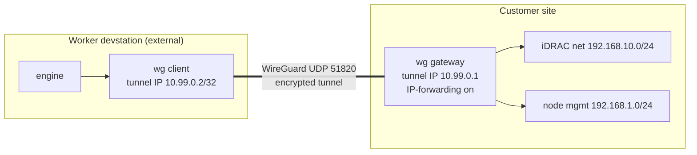

# VPN-NETWORK-ACCESS — reaching the customer's iDRAC network

> Blueprint 16 (addendum). How the worker devstation — which is NOT on the customer's LAN — reaches
> the customer's out-of-band iDRAC network and node management network to build the cluster. Open
> source (WireGuard). Designed once here; every customer engagement follows it.

## The problem

The engine drives servers over **Redfish (HTTPS to the iDRACs)**, serves **virtual media (HTTP the
iDRACs pull)**, and does **WinRM (5985 to node mgmt IPs)**. All of that is on the customer's private
networks. The worker is remote. It must get **L3 reach into two customer subnets** without the
customer installing anything and without exposing those subnets to the internet.

## Networks (from the lab; the same shape at any customer)

| Network | CIDR | What's on it | Used for |
| --- | --- | --- | --- |
| iDRAC out-of-band | **192.168.10.0/24** | iDRAC BMCs (e.g. .2, .3) | Redfish control + virtual-media pull |
| Node management | **192.168.1.0/24** | node mgmt IPs (e.g. .40, .41) | WinRM after imaging + serve-iso reach |

## Topology — WireGuard, hub at the customer site



- **wg gateway** (customer side): a small WireGuard endpoint that sits on the customer LAN with a
  route to both subnets. Enables IP forwarding; advertises `AllowedIPs = 192.168.10.0/24,
  192.168.1.0/24` toward the worker. The customer provides this (or we ship a tiny appliance/config).
- **wg client** (worker): tunnel IP `10.99.0.2/32`; `AllowedIPs = 192.168.10.0/24, 192.168.1.0/24,
  10.99.0.1/32`; routes all iDRAC/mgmt traffic through the tunnel; `PersistentKeepalive = 25` for NAT
  traversal. The engine's Redfish/WinRM/serve-iso all traverse the tunnel transparently.

## WireGuard config (the contract)

```ini
# --- customer gateway (wg0) ---
[Interface]
Address    = 10.99.0.1/24
ListenPort = 51820
PrivateKey = <gateway-priv>
# enable forwarding + route the two subnets to the LAN NIC:
PostUp   = sysctl -w net.ipv4.ip_forward=1
[Peer]  # the worker
PublicKey  = <worker-pub>
AllowedIPs = 10.99.0.2/32

# --- worker client (wg0) ---
[Interface]
Address    = 10.99.0.2/32
PrivateKey = <worker-priv>
[Peer]  # the customer gateway
PublicKey  = <gateway-pub>
Endpoint   = <gateway-public-ip>:51820
AllowedIPs = 192.168.10.0/24, 192.168.1.0/24, 10.99.0.1/32
PersistentKeepalive = 25
```

- **Keys are per-run ephemeral** (curve25519, generated at provisioning); the private keys live only
  on their respective ends. The customer's gateway public key + endpoint is the "VPN profile" they
  supply; the worker's public key is sent to them to add as a peer (or they run our tiny gateway
  image which auto-registers).
- **serve-iso reachability:** the iDRACs pull virtual media over HTTP from the worker. The worker's
  serve-iso must bind an address the iDRACs can route back to — i.e. the worker's **tunnel IP
  10.99.0.2** (the gateway routes the return path). `DEPLOYER_IP=10.99.0.2` for the engine.

## Security posture

- **Encrypted, private, no internet exposure.** Only UDP 51820 to the gateway; the iDRAC/mgmt subnets
  never touch the public internet.
- **Least route.** `AllowedIPs` on the worker is exactly the two subnets + the gateway — no
  split-tunnel leak, no access to the rest of the customer LAN.
- **Ephemeral.** Keys generated per run, tunnel torn down and keys destroyed at hand-off with the
  worker. Nothing persists.
- **Reachability gate.** The worker verifies Redfish reach to every entered iDRAC IP **over the
  tunnel** before Phase 1 runs; if the tunnel or a route is wrong, the run holds — never proceeds
  blind.

## Lab simulation (proving it "as if external")

The lab has the exact shape, so we prove the model honestly:

| Role | Runs on | Why it's a real test |
| --- | --- | --- |
| **wg gateway** (customer site) | the **deployer box** — it has reach to 192.168.10.0/24 + 192.168.1.0/24 | stands in for the customer's on-LAN endpoint |
| **wg client** (external worker) | a container that **cannot** reach 192.168.10.0/24 directly (verified: timeout) | reaching an iDRAC through the tunnel is a genuine proof, not a loopback |

Success criterion: from the worker, `curl -k https://192.168.10.2/redfish/v1` returns **200 over the
tunnel**, while the same host has **no direct route** to 192.168.10.0/24. Then the console dispatches
Phase-1 inventory to that worker and gets real Redfish data — the full network model, end to end.

## Why WireGuard

Open source, in-kernel (or `wireguard-go`/`boringtun` userspace where no module), tiny config,
modern crypto, trivial per-run key rotation, and NAT-friendly with `PersistentKeepalive`. OpenVPN is
supported as a fallback for customers who mandate it, but WireGuard is the default.

## Two connection modes (market reality: every customer's VPN is different)

Customers run every kind of gateway — WireGuard, OpenVPN, Cisco AnyConnect, Palo Alto GlobalProtect,
Fortinet, IPsec. The worker supports **both** of these, chosen per customer in the VPN Manager:

### Mode A — our gateway + central relay (uniform, we control it)
The customer runs **our tiny edge gateway** (`worker/vpn/gateway-agent.js`, one per customer, dials
OUT to our AKS relay). The worker dials the same relay. No inbound firewall change on either side, no
customer VPN expertise. This is the default we recommend.

```
customer gateway (edge) --out--> [ AKS relay service ] <--out-- worker
        \_ reaches iDRAC 192.168.10.0/24                    (many customers, one relay)
```

### Mode B — bring-your-own VPN (connect to *their* gateway)
Where the customer already has an enterprise VPN, the **worker devstation** connects to it directly
using a **bundled multi-protocol VPN client suite** — no new thing for the customer to run:

| Their gateway | Worker client (open source) |
| --- | --- |
| WireGuard | `wireguard` / `wireguard-go` |
| OpenVPN | `openvpn` |
| Cisco AnyConnect / ocserv | `openconnect` (protocol `anyconnect`) |
| Palo Alto GlobalProtect | `openconnect` (protocol `gp`) |
| Fortinet | `openconnect` (protocol `fortinet`) / `openfortivpn` |
| IPsec/IKEv2 (strongSwan-compatible) | `strongswan` |

The customer supplies a **VPN profile** (config + credentials); the worker imports it, brings the
tunnel up, and — either way — runs the same reachability gate (Redfish `GET /redfish/v1` to every
iDRAC over the tunnel) before Phase 1.

**The VPN Manager records per customer:** the mode (A/B), the protocol, the gateway/relay endpoint,
the advertised subnets, and live tunnel status. The engine is identical downstream — it just gets L3
reach to the iDRAC/mgmt subnets, however that reach was established.

## Customer-side options (how they give us reach)

1. **Their existing VPN** — they hand us a WireGuard (or OpenVPN) client profile that already routes
   to the iDRAC/mgmt subnets. Simplest for them.
2. **Our tiny gateway image** — a minimal Linux (or container) they run on a box on the iDRAC LAN; it
   dials out and registers, so no inbound firewall change is needed (worker-initiated is also
   possible by flipping which side listens).
3. **Jump host** — where a full tunnel isn't allowed, an SSH/port-forward to the iDRAC subnet, wrapped
   the same way. (v2.)