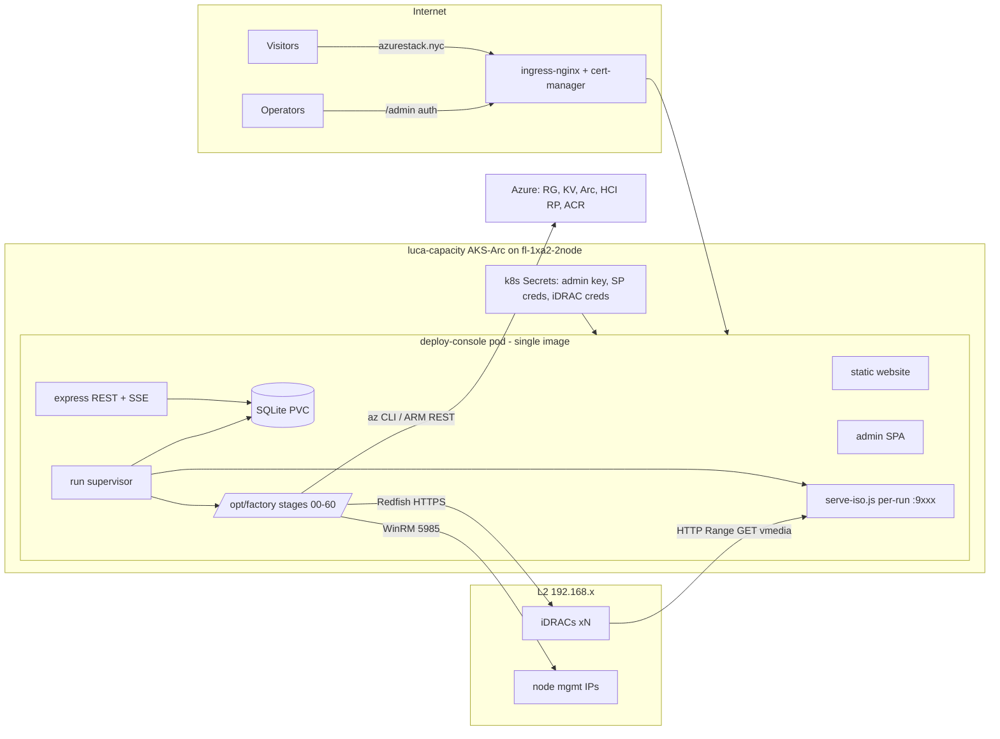
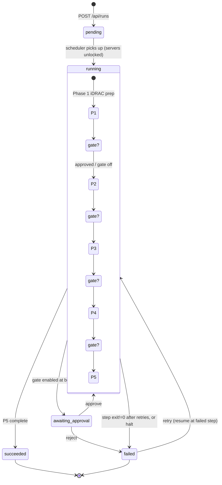
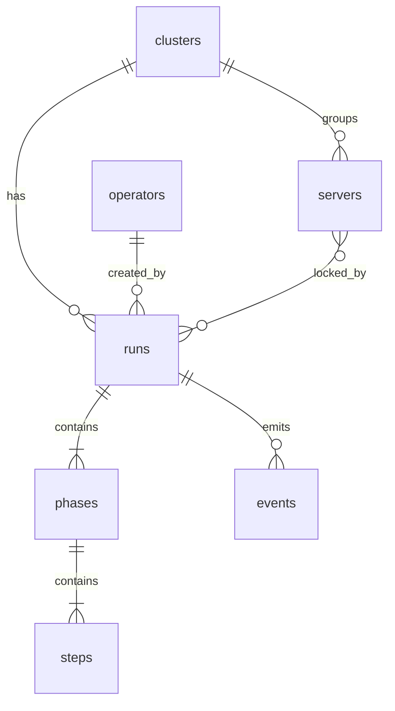

# DESIGN.md — Azure Local Deployment Console

**One sentence:** a single-image container app on the on-prem `luca-capacity` AKS-Arc cluster that serves the azurestack.nyc website, its backend, and a new operator ADMIN PAGE which runs **multiple parallel Azure Local cluster deployments** by wrapping the proven `azure-local-2node-factory` engine (bash stages 00–60) as supervised child processes with structured state, live SSE logs, and configurable operator intervention gates.

Companion docs: CORE-IDEA.md, PURPOSE.md, COST-MODEL.md, IMPLEMENTATION-PLAN.md, DEPLOYMENT.md, IMPLEMENTATION-TRACKER.csv (formation-suite mandate).

---

## 1. Where It Lives

- **Cluster:** `luca-capacity` (AKS-Arc on `fl-1xa2-2node`, kubeconfig exists). Chosen because its nodes have **L2 reach to the iDRAC management network (192.168.x)** — the console must talk Redfish to iDRACs, serve virtual-media HTTP **to** iDRACs, and WinRM to node mgmt IPs. cert-manager + ingress-nginx already live.
- **One image, three surfaces:** `/` website (azurestack.nyc pages, static), `/admin` operator SPA (vanilla JS, dark-gold aesthetic), `/api/*` REST + SSE backend.
- **Standalone-deployable:** own SQLite file on a PVC, own auth, no dependency on the Luca gateway. Platform rules still apply (response shapes, esc(), parameterized SQL, files <300 lines, auth on all data routes). If AI features are ever added they go through `token-engine.runChatCompletion` — none in v1.
- **Engine vendored into the image** at `/opt/factory` (pinned commit of `github.com/gusitllc/azure-local-2node-factory`): stages 00–60, `lib/redfish.sh`, `lib/serve-iso.js`, `lib/ext-version-sync.sh`, `lib/assign-deploy-permissions.sh`, `lib/track-deployment.sh`, `lib/fw-plan.js`/`fw-compare.js`, `build/` (gen-autounattend.js, build-combined-iso, onboard-node.ps1, gen-arm-parameters.py), `recover/recover.sh`, `rebuild-cluster.sh`.
- **Runtime toolchain in image:** node 22, bash, curl/jq, python3 + pycdlib, wimlib-imagex, xorriso, PowerShell 7 (`pwsh`) + PSWSMan (Negotiate WinRM from Linux) with a `powershell`/`powershell.exe` shim on PATH, az CLI. No Windows host dependency (kills the MSYS path traps by construction).
- **Networking:** the pod runs `hostNetwork: true` (or a dedicated LoadBalancer IP on the 192.168.x segment — Open Question OQ-1) so (a) iDRACs can pull virtual-media ISOs from `serve-iso.js` on a routable IP:port, (b) Redfish + WinRM egress works at L2. Website/admin ingress stays on ingress-nginx.



## 2. Module Contract

```js
// server boot order; each module < 300 lines
module.exports = {
  id: 'azlocal-deploy-console',
  version: '1.0.0',
  requires: ['sqlite', 'k8s-secrets(env)'],
  services: {
    db: 'lib/db.js',              // SQLite (WAL), parameterized only, migrations table
    auth: 'lib/auth.js',          // admin key bootstrap + operators, requireAuth/requireCapability
    runner: 'lib/runner.js',      // run supervisor: scheduler, gates, child-process lifecycle
    engine: 'lib/engine.js',      // stage adapter: spawn, env injection, log capture, exit->state
    redfish: 'lib/inventory.js',  // Phase-1 fan-out over lib/redfish.sh (rf_sysinfo/rf_health/...)
    events: 'lib/events.js',      // append-only event log + SSE fanout
    heal: 'lib/heal.js',          // registered heal hooks (ext-sync, retries)
  },
  routes: 'routes/*.js',          // all /api mounted behind requireAuth
  ui: ['public/', 'public/admin/'],
  health: '/api/health',          // real metrics: active runs, DB rw check, factory commit, disk free
};
```

Responses: `{ ok:true, ...data }` | `{ ok:false, error }`. All UI via fetch + vanilla JS; all user content through `esc()`.

## 3. The State Machine

A **run** = one cluster deployment through up to 5 **phases**; each phase = ordered **steps** (one engine command each). Many runs execute concurrently; each run is an independent pipeline with its own env, workdir, ISO port, and log tree.

**States (runs, phases, steps):** `pending | running | awaiting-approval | failed | succeeded | skipped`.

**Intervention gates:** per-run config `gates: { after_phase_1..4: bool, before_destructive: bool }` chosen at run creation (defaults: gate after every phase; `before_destructive` additionally pauses before stage 17 wipe-disks and before Phase-5 Deploy). A gated boundary sets the run to `awaiting-approval` and holds until `POST /api/runs/:id/approve` (or `reject` → failed). **Halt at any time** (`POST /api/runs/:id/halt`): SIGTERM→SIGKILL the current step's process group, mark step+run `failed(halted)` — required because cloud validation can dead-end (e.g. the current MSFT-side "Unsupported OS Version" RP gate) and the operator must be able to stop and hold a run at any phase.



**Step lifecycle:** `pending → running → succeeded | failed`; a step may be `skipped` by an operator with `deploy:runs:override` (recorded with actor + reason — e.g. skip firmware apply when baseline already matches). Retry resumes the run **at the failed step**, never re-running succeeded steps (all engine stages are idempotent/re-runnable by design; recover.sh covers mid-OS-install restarts).

## 4. Data Model (SQLite, WAL mode, single writer = the app)



| Table | Columns (key ones) |
|---|---|
| `clusters` | id, name, az_subscription, resource_group, location, cluster_name, config_json (NIC plan Port1..4, node names, IP plan, NTP, OU, witness), created_at |
| `servers` | id, cluster_id NULL, idrac_ip UNIQUE, idrac_user, **cred_ref** (k8s Secret key — never a password), model, service_tag, health, bios_ver, fw_json (per-component inventory), last_inventory_at, locked_by_run_id NULL |
| `runs` | id, cluster_id, status, gates_json, phase_from, phase_to, current_phase, created_by, halt_requested INT, error_verbatim TEXT (RP error, unredacted-but-secret-scrubbed), started_at, finished_at |
| `phases` | id, run_id, idx (1–5), name, status, started_at, finished_at |
| `steps` | id, phase_id, idx, name, stage_cmd, status, exit_code, attempt, max_attempts, timeout_s, log_path, error_excerpt, started_at, finished_at |
| `events` | id, run_id, ts, level (info/warn/error/gate/state), phase_idx, step_id NULL, type, message — append-only; SSE reads from here (resume via `Last-Event-ID`) |
| `operators` | id, username UNIQUE, pass_hash (scrypt), role, capabilities_json, disabled, created_at |
| `settings` | key PK, value — e.g. `factory_commit`, `iso_port_range`, `max_parallel_runs`, `default_gates`, `retry_policy_json` |

All SQL parameterized (`?`). Raw stage logs live as files under `/data/runs/<run>/<phase>/<step>.log` (PVC); DB stores paths + excerpts only.

## 5. API Surface (all under `requireAuth`; mutations under `requireCapability`)

| Method + path | Capability | Purpose |
|---|---|---|
| `POST /api/auth/login` | (allowlisted) | operator login → session token |
| `GET /api/health` | (allowlisted) | real metrics |
| `POST /api/servers` | `deploy:servers:write` | register many iDRAC IPs + cred refs |
| `POST /api/servers/inventory` | `deploy:servers:write` | fan-out `rf_reachable/rf_sysinfo/rf_health/rf_serial/rf_bios` over listed servers; upsert model/serial/health/fw |
| `POST /api/servers/:id/firmware/plan` | `deploy:servers:write` | `fw-compare.js` + `fw-plan.js` vs Dell catalog → update plan |
| `POST /api/servers/:id/firmware/apply` | `deploy:runs:approve` | Redfish SimpleUpdate (DUP over local HTTP) |
| `POST /api/clusters` / `PUT /api/clusters/:id` | `deploy:clusters:write` | cluster config (validated against config.env schema) |
| `POST /api/runs` | `deploy:runs:write` | create run `{cluster_id, server_ids[], gates, phase_from, phase_to}`; rejects if any server locked |
| `GET /api/runs`, `GET /api/runs/:id` | `deploy:runs:read` | list/detail incl. phases+steps tree |
| `GET /api/runs/:id/events` | `deploy:runs:read` | **SSE** live stream (state changes + log lines + gate prompts) |
| `GET /api/runs/:id/steps/:sid/log` | `deploy:runs:read` | full log file (range-capable) |
| `POST /api/runs/:id/approve` / `reject` | `deploy:runs:approve` | release/deny a gate (body: `{note}`) |
| `POST /api/runs/:id/halt` | `deploy:runs:approve` | kill current step, hold run |
| `POST /api/runs/:id/retry` | `deploy:runs:write` | resume at failed step |
| `POST /api/runs/:id/steps/:sid/skip` | `deploy:runs:override` | skip with reason |
| `POST /api/runs/:id/heal/ext-sync` | `deploy:runs:write` | fire `lib/ext-version-sync.sh` heal loop |
| `GET /api/runs/:id/screenshot/:serverId` | `deploy:runs:read` | `rf_screenshot` live console PNG |
| `GET/PUT /api/settings`, operators CRUD | `deploy:settings:admin` | admin-only |

## 6. Engine Adapter (child-process execution)

```mermaid
sequenceDiagram
  participant S as scheduler
  participant E as engine.js
  participant P as bash stage (process group)
  participant D as SQLite/events
  S->>E: runStep(run, step)
  E->>E: build env = cluster.config_json + secrets(from k8s Secret env, per cred_ref) + RUN_DIR/ISO_PORT
  E->>P: spawn('bash', [stage], {env, cwd:/opt/factory, detached:true})
  P-->>E: stdout/stderr line-buffered
  E->>E: redact(line) — replace every known secret value with ***
  E->>D: append events + log file; SSE fanout
  P-->>E: exit(code)
  E->>D: code==0 → succeeded; else attempt<max → retry(backoff); else failed + error_excerpt(last 50 lines + RP error verbatim)
```

- **Env injection, never files:** secrets (iDRAC passwords, `ARC_SP_SECRET`, `OS_ADMIN_PASS`) resolved from k8s Secret mounts at spawn time and passed via env only — never written to DB, config files, or logs (redaction filter is fail-closed: it knows every injected secret value). No `config.env` on disk; the adapter synthesizes the same variables the stages `: "${VAR:?}"`-require.
- **Exit-code → state:** `0`→succeeded; nonzero→failed (after retries); killed-by-halt→failed(halted); timeout (per-step `timeout_s`, e.g. 30 min stages vs. 4 h Deploy)→failed(timeout). Distinct exit codes from heal-aware stages (e.g. validate exit for ext-version mismatch) map to `failed(healable:ext-sync)` and light the one-click heal button.
- **Process groups:** `detached:true` + `kill(-pid)` so halting also kills `az rest` pollers and background `serve-iso.js`.
- **Per-run isolation:** workdir `/data/runs/<id>/`, its own `serve-iso.js` on a port from `iso_port_range` (per-file read-activity tracking feeds stage 25 eject-after-copy), its own az CLI `AZURE_CONFIG_DIR` so parallel runs never share az token cache.
- **ISO integrity:** after stage 18, adapter verifies the combined ISO with `wimlib-imagex info` on the embedded `install.wim` (extracted via **pycdlib**, no privileged mounts) — never trust filenames.
- **RP errors verbatim:** validation/deploy step failures store the raw ARM `exception` text into `runs.error_verbatim` and the step log (only secret-scrubbed) — the "Unsupported OS Version" class must reach the operator unparaphrased.

## 7. Auth

- **Bootstrap:** `ADMIN_KEY` from k8s Secret (header `x-admin-key`) — full capabilities; used to create operator accounts. Rotatable without redeploy (Secret + pod env reload).
- **Operators:** username + scrypt password → short-lived session token (httpOnly cookie). Roles→capabilities: `admin` (all), `operator` (`runs:read/write/approve`, `servers:write`), `viewer` (`runs:read`). `requireAuth` on every `/api` route except login/health; `requireCapability` on every mutation; every approve/skip/halt event records the actor.

## 8. Phase → Stage Matrix

| Phase | Step | Engine command (in `/opt/factory`) | Notes / gates |
|---|---|---|---|
| **1 iDRAC prep** | 1.1 reach+inventory | `lib/redfish.sh` fan-out: `rf_reachable`, `rf_sysinfo`, `rf_health`, `rf_serial`, `rf_bios`, `rf_storage_count` per iDRAC IP | many servers at once; populates `servers` |
| | 1.2 fw compare | `node lib/fw-compare.js <idrac1> <idrac2>` + `node lib/fw-plan.js <ip> <catalog> <sysid>` | Dell per-model catalog (`lib/parse-catalog.js`), NOT the online master catalog (known iDRAC parse failure) |
| | 1.3 fw apply | `stages/15-firmware-baseline.sh` (Redfish **SimpleUpdate**, DUPs served over run-local HTTP) | matched NIC fw is mandatory (Broadcom 20.08 driver-bind incident) |
| | 1.4 preflight | `stages/10-preflight.sh`, `lib/hw-validate.sh`, `lib/disk-inventory.sh` | data-disk symmetry check (Deploy prereq) |
| **2 Node build** | 2.1 images | `stages/05-download-images.sh` | cached on PVC across runs |
| | 2.2 wipe | `stages/17-wipe-disks.sh` (`rf_system_erase`) | **destructive → `before_destructive` gate** |
| | 2.3 build ISOs | `stages/18-build-isos.sh` (`build/gen-autounattend.js`, `build/build-combined-iso.ps1` via pwsh) + wim verify | self-wiping WinPE combined ISO per node; server names, NIC IPs baked in |
| | 2.4 boot | `stages/20-idrac-bootstrap.sh` (`rf_vmedia_insert`, `rf_boot_once_vcd`) + `stages/25-eject-after-copy.sh` | serve-iso read-quiet signal drives eject |
| | 2.5 OS wait | `stages/30-os-wait.sh` (ping + WinRM 5985 probes) | `rf_screenshot` on demand for stuck installs |
| | 2.6 NICs+time | `stages/32-nic-names.sh` (Port1..4 rename + IPs), NTP/timezone via `build/onboard-node.ps1` module chain | WinRM Negotiate via pwsh+PSWSMan |
| | 2.7 drivers | `stages/35-drivers.sh` (`lib/install-vendor-drivers.ps1`) | |
| **3 Arc + Azure prep** | 3.1 Azure prep | `stages/00-azure-prep.sh` — RP registration, RG + region, **witness storage**, Arc SP create/refresh | idempotent |
| | 3.2 KV + secrets | `deploy/` prep: Key Vault + **3 deployment secrets** (LocalAdmin, DeploymentUser, WitnessStorageKey) | secrets straight from env→KV, never logged |
| | 3.3 permissions | `lib/assign-deploy-permissions.sh` | proven fix for "Failed to download deployment settings file using edge Arm client" |
| | 3.4 Arc onboard | `stages/40-arc-register.sh` + wait for the **4 AzureEdge extensions** (LcmController, DeviceManagementExtension, TelemetryAndDiagnostics, EdgeRemoteSupport) | |
| | 3.5 ACR prep | ACR access for post-deploy workloads | |
| **4 Validation** | 4.1 settings | `lib/build-deployment-settings.js` + `build/gen-arm-parameters.py` | |
| | 4.2 Validate | `stages/50-cluster-deploy.sh --validate` → ARM REST `deploymentSettings` PUT (Validate) + edge validate; tracked via `lib/track-deployment.sh` (~25 steps/~15 min) | on ext-version mismatch → **heal: `lib/ext-version-sync.sh`** (validator is source of truth, pin exact versions, loop) |
| **5 Create + monitor** | 5.1 Deploy | `stages/50-cluster-deploy.sh` (ARM REST Deploy) | ~55 ECE steps, 2.5–3 h; gate before start |
| | 5.2 live track | `lib/track-deployment.sh <interval>` → parsed into step events → admin progress bar | RP failures verbatim |
| | 5.3 post-deploy | dashboard: cluster health, `stages/60-aks.sh` (optional AKS enable), `lib/publish-status.sh` | recover path: `recover/recover.sh`, full redo: `rebuild-cluster.sh` |

## 9. Failure / Heal Hooks & Retry Policy

- **Registered heals** (`lib/heal.js`): `ext-sync` (Phase-4 extension-version mismatch → auto-offer or auto-run `ext-version-sync.sh`, then re-Validate), `erase-unstick` (`rf_erase_unstick` + `rf_job_queue_clear` + `rf_idrac_reset` for wedged SystemErase), `eject-retry` (vmedia stuck), `az-relogin` (SP token expiry mid-run).
- **Retry policy** (per step class, in `settings.retry_policy_json`): Redfish calls 3× exp backoff; OS-wait is a poll not a retry; Validate 2× only after a heal ran; **Deploy is never auto-retried** — always a gate.
- **Known-unhealable:** RP-side gates (e.g. "Unsupported OS Version" on GA builds reading edge inventory processorType/osProfile) → run parks `failed`, error verbatim, operator halts/holds and escalates to MSFT; retry resumes at 4.2 once the RP gate lifts.

## 10. Parallelism

Scheduler runs up to `max_parallel_runs` (default 3) concurrent runs; a **server can belong to exactly one active run** (`locked_by_run_id`, enforced at run creation and in SQLite transaction). Shared, contention-safe resources: image cache (read-only after 05), ISO port pool, az config dirs per run. SQLite WAL + single-process writer makes run-state races structurally impossible.

## 11. Build Sequence

1. db.js + migrations + auth (admin key) → 2. servers + inventory (Phase 1 read-only) → 3. engine adapter + events/SSE + one-stage run (stage 10) → 4. state machine + gates + halt/retry → 5. Phase 2 destructive path behind `before_destructive` gate → 6. Phases 3–5 + heal hooks → 7. admin UI polish + parallel-run scheduler → 8. Dockerfile + k8s manifests + secrets → 9. E2E: rebuild one real 2-node cluster end-to-end from the console (acceptance test in IMPLEMENTATION-PLAN).

## 12. Open Questions

- **OQ-1 vmedia reachability:** `hostNetwork: true` vs. a MetalLB/LoadBalancer IP on 192.168.x for serve-iso — hostNetwork is simplest but pins port ranges to the node; decide after checking luca-capacity CNI. (Blocking for Phase 2.)
- **OQ-2 Linux WinRM:** pwsh + PSWSMan `Invoke-Command -Authentication Negotiate` must be validated against the node install-time local admin; fallback = pywinrm shim that the adapter substitutes for the `powershell` calls in stages 30/32/35/40. (Engine currently assumes Windows `powershell.exe`.)
- **OQ-3 ISO build on Linux:** `build/build-combined-iso.ps1` under pwsh + wimlib + xorriso needs a proven run; fallback = a small Windows builder step (existing deployer box) invoked over WinRM, ISO uploaded to the PVC.
- **OQ-4 N-node generalization:** engine is 2-node-switchless-shaped (NODE1_/NODE2_ env). Console models N servers now; stages beyond 2 nodes need a parameterization pass — v1 constrains runs to 2-node clusters.
- **OQ-5 credential store:** k8s Secret per iDRAC (v1) vs. Azure Key Vault refs (v2, better rotation/audit).
- **OQ-6 SQLite→Postgres:** if the console later joins the Luca platform DB, swap db.js for the aios-core-db facade (schema `azlocal`); interface kept facade-shaped now to make that a migration, not a rewrite.
- **OQ-7 dual-operator approval** for destructive gates (wipe, Deploy) — required or optional policy?
