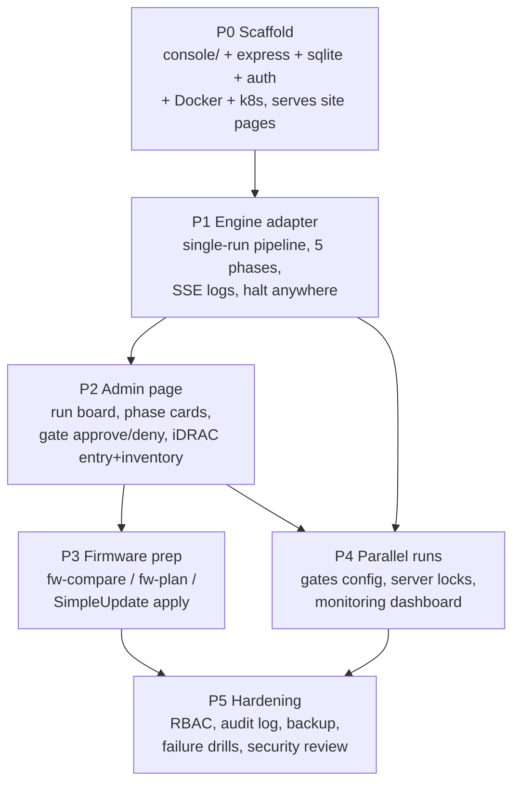
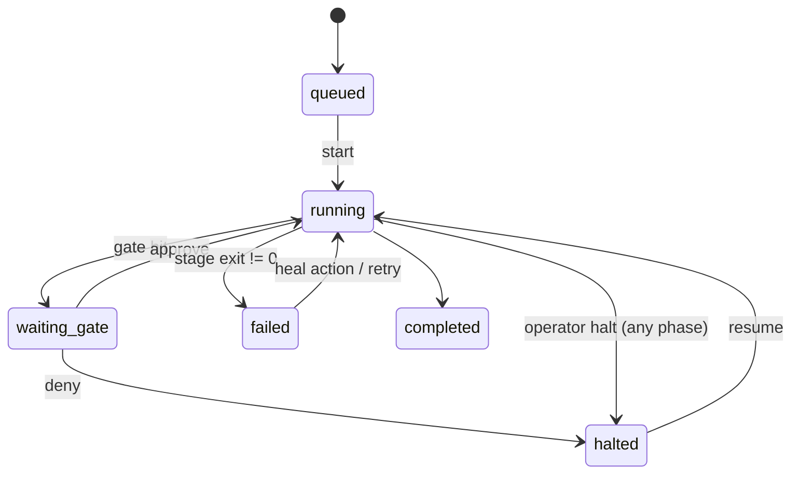

# IMPLEMENTATION-PLAN.md — Azure Local Deployment Console

**Product:** Azure Local Deployment Console — single-image container app on AKS-Arc `luca-capacity` (fl-1xa2-2node, L2 reach to iDRACs at 192.168.x). Serves the azurestack.nyc live-deployment site pages, the backend services, and a new operator **admin page** for parallel, gated, multi-cluster Azure Local deployments.
**Engine (wrapped, not rewritten):** [github.com/gusitllc/azure-local-2node-factory](https://github.com/gusitllc/azure-local-2node-factory) — bash stages `00–60`, `lib/redfish.sh`, `build/` (gen-autounattend, combined-ISO builder, onboard-node.ps1 chain, gen-arm-parameters.py), `recover/recover.sh`, `rebuild-cluster.sh`.
**Stack (decided):** Node.js 22 + Express, SQLite (file, WAL, single-writer), SSE for live logs, vanilla JS frontend (dark-gold azurestack.nyc aesthetic), one Dockerfile, k8s Deployment+Service+Ingress, secrets via k8s Secret.
**Mandate status:** >40h big task → full 7-artifact formation suite applies. Sibling docs: CORE-IDEA.md, PURPOSE.md, DESIGN.md, COST-MODEL.md, DEPLOYMENT.md, IMPLEMENTATION-TRACKER.csv (one row per step below).
**Classification:** feature-new → architect spec gates to gus@gusit.de before build starts (engineering.approval_queue). All other gates are agent-autonomous.

---

## 1. Scope & Non-Goals

**In scope:** run orchestration around the proven factory stages; multiple simultaneous runs; configurable intervention gates; iDRAC bulk entry + inventory; firmware baseline/plan/apply (Redfish SimpleUpdate); Arc + Azure prep; validation with known heal paths; ECE deploy tracking + post-deploy monitoring; RBAC, audit, backup.

**Not in scope:** rewriting any stage logic in JS (stages stay bash, executed as child processes); multi-tenant SaaS; Luca platform DB/token-engine coupling (standalone-deployable — own SQLite + REST; token-engine only if an AI feature is ever added); React or any framework (vanilla JS only).

**Platform rules that bind every phase:** auth on all data routes + capability checks on mutations; `{ok:true,...}|{ok:false,error}` response shape; `esc()` on all user/device-derived DOM content; parameterized SQL; files < 300 lines; secrets NEVER in code or logs (k8s Secret / env only); every behavior-controlling value configurable via env.

---

## 2. Engineering Roster & Assignment

| Role (agent-id) | Model tier | Responsibility |
|---|---|---|
| **eng-architect** | Opus 4.8 (role exception) | Owns DESIGN.md contract, run/gate state machine, phase→stage mapping schema, API surface. Signs entry gate of every phase. |
| **eng-builder-1** (backend) | per license | Express app, SQLite layer, run executor, engine adapter, SSE, scheduler. |
| **eng-builder-2** (frontend) | per license | Admin board, run detail, gate UI, iDRAC entry/inventory UI, dark-gold theme port. |
| **eng-tester** | per license | Redfish/WinRM **mock harness** (recorded fixtures from the live R640s), CI pipeline-in-mock runs, XSS/injection tests, per-phase E2E scripts. |
| **eng-reviewer** + **eng-reviewer2 (Nadia)** | Fable 5 for complex reviews | Two distinct non-author approvals on every PR (merge gate). Security-sensitive diffs (auth, exec, Redfish) get reviewer2 mandatory. |
| **eng-deployer** | per license | Dockerfile, k8s manifests for `luca-capacity`, image builds, per-phase deploys behind flags, backup/restore drill. |
| **eng-fixer** | per license | Owns bug tickets from P1 live runs onward; P5 failure drills. |
| **Delivery manager (Claude, this seat)** | — | Tracker upkeep, stage-gate adjudication, dispatch, closure through change-management + release process. |
| **Owner (gus)** | — | feature-new approval; live-hardware gate approvals in P1/P3/P4 E2E; final GO. |

One task → one branch (`agent/<id>/T-ALDC-P<n>-<step>`) → one squash-merge PR. Conventional Commits + `Task:/Agent:/Risk:` trailers.

---

## 3. Phase Dependency Graph

P3 and P4 may run **in parallel** by different builders once P2 exits (P3 = builder-1 + tester; P4 = builder-1 scheduler core then builder-2 dashboard). P5 starts only when both are closed.

---

## 4. Stage-Gate Mechanics

Two distinct gate systems — do not conflate them:

### 4.1 Engineering stage-gates (this plan)
- **Entry gate (per phase):** prior phase exited; DESIGN.md section for this phase approved by eng-architect; tracker rows created (Status=pending, Owner, Validator, Acceptance filled).
- **Exit gate (per phase):** all steps merged via 2-approval PRs; acceptance criteria demonstrated (recorded evidence linked in tracker `Gap Report` column when partial); phase E2E test passed in **mock** AND (where specified) **live bench**; feature flag merged **default-off**; image built via `az acr build`, deployed to `luca-capacity` behind flag; validator sign-off row updated; gap report filed for anything deferred.
- **Fail-closed:** a phase that misses acceptance does not open the next phase; gaps either fix-forward inside the phase or get an explicit owner-approved deferral row.
- **Closure of the whole task:** change-management entry → release-tracker register → `az acr build` → deploy (console's own manifest on luca-capacity; the luca-dev airlock does not apply, but deploys after operator adoption follow the 8 PM–4 AM ET window) → record-deploy → verify live → tracker reflects released state.

### 4.2 Runtime intervention gates (the product feature)
Per-run configurable pause points. State machine:

- Gate definitions = JSON template chosen at run creation (which phase boundaries and intra-phase points pause); editable pre-start; **mandatory gates** (firmware apply, cluster-deploy submit) are non-removable.
- Every gate decision records who/when/context-payload-hash in the audit log (P5 makes it tamper-evident).
- **Halt works at any phase** — hard requirement from the "Unsupported OS Version" week: operator must be able to stop a run cold and read the RP error verbatim.

---

## 5. Phases

### P0 — Scaffold (`console/` in the factory repo)

Console lives at `console/` inside `azure-local-2node-factory` so the engine ships in the same image at a pinned relative path.

**Steps**
| # | Step | Owner |
|---|---|---|
| 0.1 | Repo layout: `console/{server.js, src/routes/, src/db/, src/mw/, public/, test/, Dockerfile, k8s/}`; ESLint; files-<300-lines check in CI | builder-1 |
| 0.2 | Express app: serves existing azurestack.nyc live-deployment site pages (static, unauthenticated) + `/healthz` with real metrics (db ok, engine present, disk free on ISO volume) | builder-1 |
| 0.3 | SQLite via better-sqlite3: WAL mode, versioned `.sql` migrations + runner; core tables `users, sessions, servers, runs, run_phases, run_steps, gates, logs, audit_log` (parameterized SQL only) | builder-1 |
| 0.4 | Auth: operator accounts (bcrypt), session cookie, `requireAuth` on ALL `/api/*`, `requireCapability` middleware (capability map stubbed until P5); bootstrap admin from k8s Secret env | builder-1 |
| 0.5 | Dockerfile (node:22 on debian-slim): bash, curl, jq, python3+pycdlib, wimlib-imagex, az CLI, git; engine vendored at `/engine` (pinned SHA); non-root user; no secrets baked | deployer |
| 0.6 | k8s for luca-capacity: Deployment (PVC for SQLite + ISO store; `hostPort`/NodePort range for the virtual-media HTTP server so **iDRACs can reach it**), Service, Ingress `console.azurestack.nyc` (cert-manager + ingress-nginx already live), Secret template | deployer |
| 0.7 | Log scrubber middleware skeleton: redaction list from env (passwords, SP secrets) applied to every persisted log line — in from day one, not retrofitted | builder-1 |

**Acceptance criteria**
- Container builds; site pages serve 200 unauthenticated; `/api/runs` → 401 unauthenticated, 200 `{ok:true,runs:[]}` after login.
- SQLite survives pod restart (PVC); `/healthz` returns real metrics.
- Deployed on luca-capacity behind flag; canary secret string never appears in any persisted log.

**Feature flag:** `CONSOLE_ENABLED` (gates `/admin` + `/api`; site pages always on).

**E2E test use case:** *Fresh deploy to luca-capacity: operator hits console.azurestack.nyc, sees the live-deployment site; logs in with bootstrap admin; API answers; pod deleted and rescheduled — state intact.*

---

### P1 — Engine adapter + single-run pipeline

**Steps**
| # | Step | Owner |
|---|---|---|
| 1.1 | Engine adapter: spawn stage scripts as child **process groups**; per-run working dir; `config.env` **generated** from the run record with secrets injected via env at spawn (never written to disk unencrypted, never logged) | builder-1 |
| 1.2 | Structured logs: stdout/stderr → `{run_id, phase, stage, ts, stream, line}` rows + SSE ring buffer; scrubber applied pre-persist | builder-1 |
| 1.3 | Phase→stage mapping (config JSON, not code): **Phase1 iDRAC prep**→`15-firmware-baseline` (+P3 additions); **Phase2 node build**→`17-wipe-disks, 18-build-isos, 20-idrac-bootstrap, 25-eject-after-copy, 30-os-wait, 32-nic-names, 35-drivers`; **Phase3 Arc+Azure prep**→`00-azure-prep, 05-download-images, 40-arc-register` + `lib/assign-deploy-permissions.sh` (SPs, RG/region, RP registration, KV + 3 deployment secrets, witness storage, ACR prep); **Phase4 validation**→edge validate + deploymentSettings/ARM Validate with heal actions (`lib/ext-version-sync.sh`, retry); **Phase5 deploy+monitor**→`50-cluster-deploy` + `lib/track-deployment.sh` (`60-aks` optional post-step) | architect + builder-1 |
| 1.4 | Run lifecycle API: `POST /api/runs`, `POST /api/runs/:id/start\|halt\|resume`, `GET /api/runs/:id`; halt = SIGTERM the process group, state→halted, resumable per `recover/recover.sh` semantics | builder-1 |
| 1.5 | SSE: `GET /api/runs/:id/logs/stream` with heartbeat + `Last-Event-ID` resume | builder-1 |
| 1.6 | **Verbatim RP error capture:** nonzero stage exit stores exit code + tail + any parsed ARM/RP error JSON *unmodified* on the run (the "Unsupported OS Version" class must be readable word-for-word) | builder-1 |
| 1.7 | Phase2 wrapper invariants (from RE-IMAGE-LESSONS): WIM verified with `wimlib-imagex info` before boot (never trust filenames); ISO content extraction via **pycdlib** (no privileged mounts); no vmedia eject/ForceRestart between installer boot and OS-up (`25-eject-after-copy` only after copy confirmed); completion gated on **OS BUILD number**, not WinRM-alive; path normalization layer (in-container = POSIX; dev-on-Windows MSYS `/e/…`→`E:\e\…` trap guarded with the `sed -E 's#^/([a-zA-Z])/#\1:/#'` converter) | builder-1 |
| 1.8 | Mock engine (`ENGINE_MOCK=1`): recorded Redfish/WinRM fixtures replay every stage's happy path + canned failures — CI runs the full pipeline with zero hardware | tester |
| 1.9 | `rf_screenshot` exposure: adapter can invoke `lib/redfish.sh` screenshot on demand and store the PNG on the run (the only eyes into WinPE/Setup) | builder-1 |

**Acceptance criteria**
- Mock: full 5-phase run green in CI; injected stage failure → `failed` with verbatim error; halt/resume works mid-Phase2.
- Live: one full run on the bench R640 pair completes Phase1→Phase5 with live SSE logs; re-image verified by OS build; ECE deploy tracked to completion (~2.5–3 h).
- Canary-secret log test still clean; child processes die with the run (no orphan bash).

**Feature flag:** `PIPELINE_ENGINE_ENABLED`.

**E2E test use case:** *Operator POSTs a run for the bench pair via curl, starts it, tails SSE, halts during Phase2, resumes, run finishes with a deployed cluster; then a deliberately wrong OS image triggers a Phase4 validation failure whose RP error reads verbatim in the run record.*

---

### P2 — Admin page

**Steps**
| # | Step | Owner |
|---|---|---|
| 2.1 | `/admin` multi-run board (capability `console:runs:read`): card per run — name, cluster, phase progress, state chip (running / waiting-gate / halted / failed / done); auto-refresh via SSE summary channel | builder-2 |
| 2.2 | Run detail: **5 phase cards**, each listing its stages with status; expandable live log pane (SSE); verbatim error panel; `rf_screenshot` button; halt/resume buttons | builder-2 |
| 2.3 | Intervention gate UI: waiting-gate banner shows context payload (what will happen next, target servers, plan diff); **Approve / Deny** → `POST /api/runs/:id/gates/:gid/approve\|deny` (capability `console:gates:approve`); deny → halted | builder-2 + builder-1 |
| 2.4 | iDRAC server entry: textarea paste of many iDRAC IPs + credentials **reference** (k8s Secret key, never raw creds in the form); "Inventory" → Redfish probe per server → table of model, serial, service tag, health, current firmware; results persisted to `servers` | builder-2 + builder-1 |
| 2.5 | Run creation wizard: pick inventoried servers → cluster name/RG/region ("zone") → gate template → create (Phase1 pre-populated) | builder-2 |
| 2.6 | Aesthetic: port azurestack.nyc dark-gold CSS; vanilla JS + fetch only; `esc()` on **everything** rendered — log lines and Redfish strings are device-influenceable | builder-2 |
| 2.7 | SSRF guard: iDRAC IP field validated against configurable RFC1918 CIDR allowlist (`IDRAC_CIDR_ALLOWLIST`) — console must not become a proxy to arbitrary hosts | builder-1 |

**Acceptance criteria**
- Full operator loop in mock: enter 2 iDRAC IPs → inventory rows appear → create run → gate fires → approve → completes; deny path halts.
- Hostile log line (``) renders inert; out-of-allowlist IP rejected with `{ok:false,error}`.
- Board correct with 1 running + 1 halted + 1 done run.

**Feature flag:** `ADMIN_CONSOLE_ENABLED`.

**E2E test use case:** *Headless-browser script: login → add two mock iDRACs → inventory → create gated run → watch phase cards progress → approve the Phase2 gate → run completes; repeat with deny → run halts and board shows it.*

---

### P3 — Firmware prep (Phase 1 deepened)

**Steps**
| # | Step | Owner |
|---|---|---|
| 3.1 | Integrate `lib/fw-compare.js`, `lib/fw-plan.js`, `lib/parse-catalog.js` as required node modules: full inventory diff vs baseline; per-node plan scoped to devices **actually present** (PCI identity quad / ComponentID) | builder-1 |
| 3.2 | Catalog handling: Dell catalog `.gz` decoded as **UTF-16**; per-model **scoped** catalog; DUP repository stored on the console's range-capable HTTP share (same server the iDRACs already reach for virtual media) | builder-1 |
| 3.3 | Plan preview UI: component table (current → target, reboot-required, risk class) rendered before the **mandatory, non-removable gate** ahead of any flash | builder-2 |
| 3.4 | Apply: per-DUP Redfish `UpdateService.SimpleUpdate` (ImageURI = console HTTP URL) with Redfish job/task polling to terminal state; host reboot orchestration for host-applied components (NIC/HBA); iDRAC firmware self-resets — handled | builder-1 |
| 3.5 | Safety policy engine: **NIC firmware must match the driver family** — a plan that jumps NIC fw without a staged matching driver is auto-HELD with the Broadcom NDC (fw 20.08 vs driver 22.x) rationale shown; `InstallFromRepository` against the online master catalog is a **blocked code path** (known "internal error" failure) | builder-1 |
| 3.6 | Baseline management: named firmware baselines per model stored in DB; Phase1 = inventory → compare-to-baseline → plan → (gate) → apply → re-inventory verify | builder-1 |

**Acceptance criteria**
- Plan output for a bench node byte-matches manual `recover.sh fw-compare`/`fw-plan` runs.
- Live: one DUP (iDRAC firmware — self-resetting, safe) applied via SimpleUpdate with tracked job; post-apply inventory shows version bump.
- Risky NIC jump auto-held with explanation; master-catalog path provably unreachable (test asserts 400).

**Feature flag:** `FIRMWARE_PREP_ENABLED`.

**E2E test use case:** *Bench iDRAC: inventory → baseline compare shows N stale components → plan preview → mandatory gate approve → iDRAC firmware DUP flashes, job tracked to completion → re-inventory confirms target version; a mock node with a big NIC jump shows HELD, not applied.*

---

### P4 — Parallel runs + gates config + monitoring dashboard

**Steps**
| # | Step | Owner |
|---|---|---|
| 4.1 | Scheduler: N concurrent runs (env `MAX_CONCURRENT_RUNS`), each with own process group, working dir, and **virtual-media HTTP port from a pool** (per-run `serve-iso` instance; ports pre-opened in the k8s manifest) | builder-1 |
| 4.2 | Server locking: a server (keyed by iDRAC IP) belongs to at most one active run — claim enforced by SQLite unique constraint at start; double-claim → `{ok:false,error}` | builder-1 |
| 4.3 | Single-writer discipline: all state mutations through one serialized writer queue (WAL for readers/SSE fan-out) — no cross-run write races | builder-1 |
| 4.4 | Gate templates: named, versioned JSON profiles (e.g. "fully-gated", "firmware-only gates", "lights-out"); per-run override pre-start; mandatory gates enforced server-side regardless of template | builder-1 + architect |
| 4.5 | Monitoring dashboard: per-run post-deploy view driven by `lib/track-deployment.sh` / deploymentSettings `reportedProperties.deploymentStatus.steps` (live ECE step tree, elapsed vs ~2.5–3 h expected); fleet view across runs | builder-2 |
| 4.6 | Alert hooks: webhook + email (Resend) on `failed`, `waiting_gate`, and completion (env-configured, off by default) | builder-1 |
| 4.7 | Phase4 heal actions as one-click buttons on a failed validation: run `ext-version-sync`, retry Validate — each action audited | builder-2 + builder-1 |

**Acceptance criteria**
- Two simultaneous mock runs complete with zero log interleave (every log row carries correct run_id) and distinct vmedia ports.
- Live+mock mix: live bench run unaffected by a mock run started/denied mid-flight.
- Server double-claim rejected; mandatory gate survives a template that tries to remove it; dashboard step tree matches `track-deployment.sh` output.

**Feature flag:** `PARALLEL_RUNS_ENABLED` (single-run mode remains the fallback).

**E2E test use case:** *Start live Run A (bench pair, fully-gated). Mid-Phase2, start mock Run B on different "servers". Approve A's gates as they fire; deny B's firmware gate → B halts, A proceeds to deployed cluster; board and monitoring dashboard show both truthfully throughout.*

---

### P5 — Hardening: RBAC, audit log, backup

**Steps**
| # | Step | Owner |
|---|---|---|
| 5.1 | RBAC: roles `console-admin`, `operator`, `viewer` → capability map (`console:runs:write`, `console:gates:approve`, `console:firmware:apply`, `console:servers:write`, `console:admin`); `requireCapability` on every mutation route; role admin UI | builder-1 |
| 5.2 | **Tamper-evident audit log:** hash-chained rows for every mutation, gate decision, heal action, login (who/when/payload-hash); chain-verify endpoint; reuse the platform tamper-evident-log pattern (Golden Rule 11 — extend, don't fork) | builder-1 |
| 5.3 | Secrets hygiene pass: iDRAC/SP creds referenced exclusively from k8s Secret (no plaintext at rest in SQLite); scrubber list regression suite; grep-gate in CI for credential patterns | builder-1 + tester |
| 5.4 | Backup: SQLite online-backup to PVC snapshot path + nightly export to Azure Storage (dedicated container) with retention; **restore runbook + drill** | deployer |
| 5.5 | Failure drills: kill pod mid-run → run marked `interrupted`, resumable (recover.sh semantics); node reboot; disk-full on ISO volume → graceful refusal, not corruption | fixer + tester |
| 5.6 | Security review: `/security-review` + checklist — auth bypass, SSRF (CIDR allowlist re-test), command injection through run config (all engine args validated + safely quoted; config values never interpolated into shell strings), session fixation, SSE auth | reviewer2 + fixer |

**Acceptance criteria**
- RBAC matrix test passes (viewer approve-gate → 403 + audit row); audit chain verifies after 10k events; broken chain detected.
- Restore drill: fresh pod from backup < 15 min, runs history intact.
- All security checklist items closed or owner-accepted with gap report; pod-kill drill leaves a resumable run.

**Feature flag:** hardening lands under existing flags; RBAC enforcement staged behind `CONSOLE_RBAC_ENFORCED`.

**E2E test use case:** *Viewer account attempts gate approval and firmware apply → both 403 and audited; operator completes a gated run; pod is killed mid-Phase3 → run resumes to completion; DB restored from last night's backup onto a scratch deployment and shows the same audit chain, which verifies.*

---

## 6. Program-level end-to-end acceptance (GO/NO-GO)

*Two-cluster parallel live deployment:* from a clean console on luca-capacity, an operator enters four iDRAC IPs (two pairs), inventories them, firmware-preps one pair through a held-then-approved plan, launches two runs (one live bench pair fully gated, one mock), approves gates through Phase5, and watches the live cluster reach deployed via the ECE step tracker — with zero secrets in logs, every decision in the audit chain, and RP errors (if any) verbatim on screen. Owner sign-off on this scenario closes the task through change-management + release process, and IMPLEMENTATION-TRACKER.csv is updated to released state.

---

## Appendix A — Research Foundations

### A.1 RE-IMAGE-LESSONS 1–9 (hard-won 2026-07-01) → design bindings
| # | Lesson | Console binding |
|---|---|---|
| 1 | `serve-iso.js` must get a Windows-style root, not `/e/apps/iso` | Adapter path-normalization layer; in-container POSIX is native, dev-on-Windows converter guarded (P1.7) |
| 2 | Windows Setup runs HANDS-OFF — no eject/ForceRestart mid-install | Phase2 wrapper forbids vmedia ops between installer boot and OS-up; `25-eject-after-copy` only after copy confirmed |
| 3 | "Upgrade or clean install?" dialog = Disk 0 already has an OS | `17-wipe-disks` always precedes 18/20 in the Phase2 mapping; wipe is a mandatory stage, not optional |
| 4 | iDRAC screenshots are the only eyes into WinPE/Setup | `rf_screenshot` first-class button on run detail (P1.9, P2.2) |
| 5 | Verify a re-image by OS BUILD, not just WinRM | Phase2 completion gate = build number check (P1.7) |
| 6 | HBA330 non-ISE: `CryptographicErasePD` is a silent no-op — use `OverwritePD` | Wipe implementation choice enforced in stage config; surfaced in plan preview |
| 7 | Interrupted SystemErase leaves a stale "wipe already running" flag — iDRAC reboot clears it | Heal-path button on Phase2 failures |
| 8 | winpeshl LaunchApps + setup.exe: the stub must never exit early | ISO-builder invariant covered by WIM verification + mock replay tests |
| 9 | The 0x01 corruption class: `\1` written through an escape-interpreting layer | Adapter passes files, never inline escaped strings, to engine scripts |

### A.2 Gotcha catalog (this build cycle)
- **Cloud validation can reject GA builds** — "Unsupported OS Version" (open MSFT-side gate reading edge inventory processorType/osProfile) → verbatim RP error surfacing + halt-anywhere are hard requirements, not niceties.
- **Dell online MASTER catalog `InstallFromRepository` fails** ("internal error", catalog too big) → scoped catalog or per-DUP SimpleUpdate from console-hosted HTTP share; master-catalog path blocked in code.
- **Dell catalog `.gz` is UTF-16** (parse-catalog.js).
- **NIC firmware must match driver family** — Broadcom NDC invisible to OS at fw 20.08 vs driver 22.x; fixed out-of-band via Redfish SimpleUpdate; console auto-holds risky NIC jumps.
- **Never trust ISO/WIM filenames** — verify with wimlib; **pycdlib** extraction instead of privileged mounts.
- **MSYS/Windows path traps** — `/e/…` → `E:\e\…` mangling; `${1:-{}}` brace-default appends a stray `}`.
- **S2D disk symmetry** — Validate fails on PhysicalDisk instance-count mismatch (2x-t4-fl: 4SSD/6HDD vs 2SSD/3HDD) → `hw-validate.sh` runs before firmware in autopilot; console surfaces symmetry pre-flight.
- **Deployer runtime needs:** L2 reach to iDRACs; range-capable HTTP server the iDRACs can reach; WinRM reach to node mgmt IPs; az CLI + SP creds; wimlib; node; python — all baked into the P0 image + manifest.

### A.3 This week's live-deployment timeline (evidence base)
- **06-28** — Broadcom NIC root-cause on 2x-t4-fl; fw tooling built (`fw-compare.js`, `parse-catalog.js`, `fw-plan.js`, recover fw-* subcommands, commit 5586e6e).
- **06-29** — Multi-project live console + Data Center inventory publishers (builder-check, hw-validate, datacenter/services/ip inventories) proven against 3 clusters / 16 servers.
- **06-30** — 2x-t4-fl Validate failed on disk symmetry; paused for physical drive rebalance — the archetype of an intervention-gate + verbatim-error workflow.
- **07-01** — Re-image lessons codified (RE-IMAGE-LESSONS.md 1–9); `rebuild-cluster.sh` one-shot proven; engine published as `azure-local-2node-factory` with stages 00–60 + mermaid-documented README.

### A.4 Industry references
DMTF Redfish spec (UpdateService.SimpleUpdate, VirtualMedia, one-time boot); Azure Local deployment ARM surface (`deploymentSettings` Validate/Deploy, ECE step reporting); Azure Arc connected-machine + 4 AzureEdge extensions; CloudNativePG-style single-writer discipline applied to SQLite WAL.

---

## Appendix B — PhD Senior-Engineer Review & Sign-off (placeholder)

> To be completed by an independent PhD-level senior engineer (Fable 5 tier) during the review phase, per the formation mandate. The review MUST cover:
>
> 1. **Concurrency model** — process-group isolation, SQLite single-writer queue, per-run vmedia port pool: race and starvation analysis.
> 2. **Failure semantics** — halt/resume/interrupted-run correctness against recover.sh semantics; idempotency of each phase's stages on retry.
> 3. **Security** — exec-boundary (config→shell) injection surface, SSRF allowlist, secrets flow (k8s Secret → env → child process), audit-chain soundness.
> 4. **Firmware safety policy** — NIC fw/driver pairing rule completeness; blast-radius of a wrong DUP.
> 5. **Operational fit** — single-pod SPOF assessment on luca-capacity, backup/restore RPO/RTO, monitoring fidelity vs raw `track-deployment.sh`.
>
> | Field | Value |
> |---|---|
> | Reviewer | *(name / agent-id)* |
> | Date | *(YYYY-MM-DD)* |
> | Verdict | *(APPROVED / APPROVED-WITH-CONDITIONS / REJECTED)* |
> | Conditions | *(list)* |
> | Signature | *(sign-off reference in engineering.approval_queue)* |

## Appendix — PhD Senior-Engineer Review & Sign-off

**Verdict:** revise

**Findings (fold into P1/P4):**

- F1 (engine-adapter, blocking): Per-run engine copies are mandatory, not optional. Stages anchor HERE to the engine root and both read and WRITE there: every stage does `source "$HERE/config.env"`, stage 50 writes its ARM PUT body to `$HERE/.ds_body.json`, stage 18 writes ISOs, and lib/_project-paths.sh writes `$PAGES_DIR/projects/<slug>`. A shared read-only /opt/factory breaks stage 50 outright; a shared writable one cross-contaminates parallel runs (two runs at stage 50 clobber each other's deploymentSettings body). DESIGN.md must specify: adapter clones the pinned engine into each run's workdir, renders a per-run config.env, and injects PAGES_DIR/ISO_DIR/TMPDIR per run.
- F2 (feasibility, blocking): The Linux-container claim is overstated — stage 18 cannot run on Linux as written. build/build-combined-iso.ps1 P/Invokes shlwapi.dll (SHCreateStreamOnFileEx + COM IStream, i.e. IMAPI-style ISO assembly), which is Windows-only by construction; Get-NetTCPConnection (stage 20) and Test-NetConnection (stage 30) are Windows-only cmdlets absent from pwsh-on-Linux. The plan needs either (a) a Linux ISO-build path (xorriso + wimlib is already in the image — but it must be validated against efisys_noprompt boot, the $OEM$ scripts layout, and the boot.wim swap semantics) or (b) delegating stage 18 to a Windows build runner; plus a per-stage Linux conformance matrix as a P0/P1 exit criterion. This is the largest under-budgeted item in COST-MODEL B2/B4.
- F3 (parallel isolation, blocking): az CLI context is shared global state. Stage 50 (and the Azure-prep stages) run `az account set --subscription` against ~/.azure; two concurrent runs race on subscription/token state, and multi-tenant client engagements make this worse. The adapter contract must inject per-run `AZURE_CONFIG_DIR=$WORKDIR/.azure` (each run performs its own SP login into an isolated context) while stages keep pinning --subscription per call. Same isolation applies to any ACR login state.
- F4 (parallel isolation + supervision, blocking): Stage 20 self-manages the ISO media server and will kill sibling runs. It force-kills whatever listens on HTTP_PORT (default 8080 for ALL runs) using Windows-only Get-NetTCPConnection, then nohup-spawns serve-iso.js detached from the stage process tree — so under the console it can murder another run's media server, and the orphan escapes supervisor lifecycle and pod-restart recovery. The console must own serve-iso.js per run (allocated 9xxx port, own process group, restart-on-boot re-serve) and neutralize stage 20's server management via an env flag or a vendored patch, injecting HTTP_PORT/DEPLOYER_IP/ISO_DIR per run.
- F5 (state machine): Crash/resume semantics are asserted but not specified. Bash children die with the pod; nothing reattaches to a process. The phase→stage mapping schema needs an explicit per-stage resume class: re-entrant (inventory, prep), reattach-by-poll (ECE deploy via track-deployment/ARM operation state; firmware via Redfish job ids), restart-from-stage (ISO build, 30-os-wait), destructive-requires-gate (17/20). On boot the supervisor must reconcile any step in 'running' with no live child to 'interrupted' and require an operator gate to choose the resume path. Also pin `strategy: Recreate` in the Deployment — RWO PVC + single-writer SQLite makes RollingUpdate a corruption/deadlock risk beyond just replicas=1.
- F6 (state store): Storing stage stdout in SQLite log_chunks will contend and bloat. N parallel multi-hour stages streaming verbose output through the same single-writer DB as state transitions and gate approvals invites SQLITE_BUSY on the control path and unbounded DB growth. Store per-run JSONL log files on the PVC with a byte-offset index (and SSE last-event-id mapping) in SQLite; enable WAL + busy_timeout; add rotation/GC. Keep only structured events (state changes, RP errors, artifacts) in the DB.
- F7 (security, high): The unauthenticated ISO endpoint leaks node credentials on the LAN. Combined ISOs embed autounattend.xml containing the local admin password; iDRAC virtual media cannot present auth, and hostNetwork exposes each per-run serve-iso port to all of 192.168.x. Mitigate: per-run unguessable URL path prefix (e.g. /r/<128-bit-token>/combined-<node>.iso), bind to the iDRAC-facing interface only, firewall/NetworkPolicy to the iDRAC subnet where the CNI allows, delete ISOs at run close, and record this exposure explicitly in the threat model section of DESIGN.md.
- F8 (security): iDRAC creds — env injection is the right mechanism, but two leak paths need explicit treatment: (a) lib/redfish.sh passes `-u user:pass` on the curl argv, visible in /proc/*/cmdline for up to 30s per call — acceptable single-tenant but should be documented, with a later move to `--netrc-file` on per-run tmpfs; (b) the tracker 0.4 redaction test must assert over child-stage stdout/stderr (stages echo commands liberally), not just console-emitted logs. The DEPLOYMENT.md `IDRAC_CRED_STORE_KEY` implies encrypted-at-rest creds in SQLite — DESIGN must specify the AEAD scheme, key sourcing/rotation, and the invariant that decrypted creds enter child env only, never argv, never log_chunks.
- F9 (gates): Destructive gates must be mandatory-by-default and mapped onto the engine's own guards. Stages 17/20 already refuse without ACK_WIPE=yes — the gate engine should inject ACK_WIPE=yes (and any firmware-apply ack) only upon a recorded, capability-checked approval, preserving defense-in-depth. 'Configurable per run' must not permit removing wipe/SystemErase/firmware-flash gates in v1 (make them non-removable); gate approval needs its own capability (console:gates:approve) distinct from console:runs:write.
- F10 (capacity + validation reality): 1 CPU / 2Gi limits will make concurrent wimlib/xorriso ISO builds crawl or OOM — add a global ISO-build semaphore (configurable, default 1) and a disk-headroom admission check before run start against the 100Gi PVC (combined ISOs are multi-GB per node, duplicated per run — add artifact GC). And given the live 'Unsupported OS Version' RP gate, Phase 4 must support indefinite pause → re-validate → resume-at-phase without re-imaging: an 'adopt existing nodes' run-entry mode (the recover.sh/rebuild-cluster.sh path) should be a first-class state, and full ARM error payloads should persist as run artifacts, not just log lines.

**Sign-off:**

I reviewed all six artifacts against the actual engine source (local checkout of azure-local-2node-factory) rather than the suite's description of it, and the architecture — a supervising wrapper with per-run state, gates, and SSE over proven bash stages — is the right shape and is feasible on luca-capacity. However, four findings are contract-level and must be folded into DESIGN.md/IMPLEMENTATION-PLAN.md before code starts: per-run engine copies (stages write into the engine root, e.g. stage 50's .ds_body.json), per-run AZURE_CONFIG_DIR isolation (az account set is a shared-state race), console ownership of the ISO media server (stage 20 kills by port and orphans its own server), and an honest Phase-2 Linux-port workstream (build-combined-iso.ps1 P/Invokes shlwapi.dll and cannot run under pwsh-on-Linux, contradicting the 'no Windows dependency by construction' claim). The remaining findings (resume classes, log storage, ISO-endpoint credential exposure, mandatory destructive gates, capacity guards) are spec tightenings that fit within the existing phase plan and budget. Verdict: REVISE — resubmit with F1–F4 incorporated; with those amendments I would sign off without a further full-suite review, subject to the P0 exit criterion including the Linux stage-conformance matrix.
